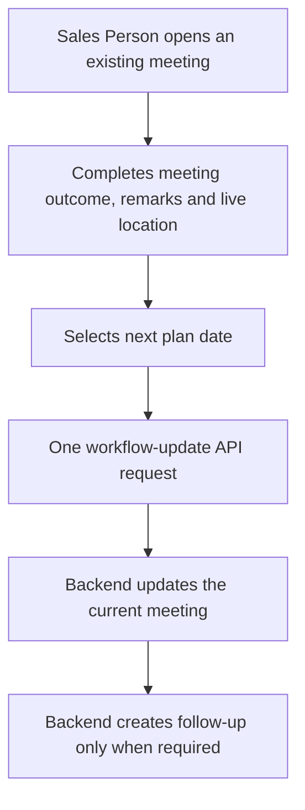

# BlueAnt CRM ERP Frontend

A role-based Expo / React Native CRM frontend for BlueAnt's lead, meeting, sales, and Sales Coordinator workflows. The application runs on Android, iOS, and web.

> **Scope of this README:** This is the handover document for the Sales Person and Sales Coordinator functionality implemented in this repository. It explains what the system does, how each role uses it, and which backend responsibilities are required for it to work correctly.

## At a glance

| Role | Main responsibility | Primary experience |
| --- | --- | --- |
| Sales Person | Work assigned leads, conduct meetings, and submit meeting outcomes. | Existing meeting update form and assigned-task workspace. |
| Sales Coordinator (SC) | Review meetings, collect verification details, assign leads, supervise task load, and export operational data. | Sales Coordinator workspace. |

## Technology

- Expo SDK 54
- React 19 and React Native 0.81
- TypeScript
- React Native Paper
- Web, Android, and iOS targets

## Run the project

```bash
npm install
npm run start
```

Other available commands:

```bash
npm run android
npm run ios
npm run web
npm run export:web
npx tsc --noEmit
```

## Sales Person workflow

A Sales Person receives and works leads/meetings. The critical action is **Meeting Update**.



### Meeting Update form

The form records meeting mode, result/status, remarks, live location, and a future next-plan date.

- **Meeting Date** is read-only and is set to the current local date when the update form opens.
- **Next Plan Date** is a separate future follow-up date.
- Live location can include address, latitude, longitude, accuracy, and a maps link.
- The client prevents duplicate submits: the button is disabled during submission and the service prevents another request for the same meeting code while the first request is active.

### Correct update API contract

For an existing meeting, the frontend calls:

```text
POST /api/v1/meetings/{CURRENT_MEETING_CODE}/workflow-update
```

The frontend does **not** create a new meeting from this flow and never generates a meeting code. Follow-up creation and unique meeting-code generation are backend responsibilities.

## Sales Coordinator workspace

The SC workspace has five tabs.

| Tab | What SC can do |
| --- | --- |
| Today Meetings | Review meetings waiting for SC verification. |
| Verified Meetings | Search, filter, export, and inspect verified meetings. |
| Sales Person Tasks | See active Sales Person leads and meetings in one task list. |
| Assign New Lead | Create a physical lead and assign it to a Sales Person. |
| Assigned Leads | Filter SC-assigned leads, view complete history, and export organised records. |

The SC workspace loads pending-verification meetings, verified meetings, all meeting records, and SC-assigned leads. It has a manual sync action and automatic refresh every 10 seconds.

### Today Meetings and verification

Today Meetings lists work awaiting SC verification. SC can open a meeting and fill details including:

- Meeting time
- Age group
- Prior investment
- Profession and firm/clinic details
- Best time for a later meeting
- Meeting-with context
- Person name and position, only when the meeting was with someone else

The table keeps its column heading visible while the list scrolls.

### Verified Meetings

Verified Meetings provides:

- Sticky, aligned column headers
- Visible right-side list scrollbar
- Header search
- Multi-select column filters
- Meeting-date range filter
- Verified-by, lead status, meeting type, and Sales Person filters
- One-click CSV export through the green Excel icon

The exported CSV can be opened directly in Excel and includes meeting fields plus SC verification fields.

### Sales Person Tasks

This is the SC's workload view. It combines:

1. Active meetings that are not completed.
2. Assigned leads that do not already have an active meeting.

This prevents a lead from appearing twice when it already has a current meeting.

Task rows are divided into:

- **Today:** task date is today
- **Pending:** active but neither today nor overdue
- **Overdue:** task date is more than seven days old

The table contains Client Name, masked Number, Meeting Type, Sales Person, and Meeting Date. The Sales Person column has a multi-select filter. Historical short/full name values, such as `Garv` and `Garv Kumar`, are shown as one full-name option and filter both variants.

Search, All/Today/Pending/Overdue buttons, a sticky list header, scrollable rows, Clear action, and CSV export are included.

### Assign New Lead

SC can create and assign a physical lead with:

- Client name and mobile number
- Location, clinic address, and speciality
- Sales Person employee code
- Assigned date

Assigned Date uses a calendar picker with month navigation and a close button.

### Assigned Leads

Assigned Leads is a card-based operational list. Every card shows client details, masked mobile number, current lead status, assigned Sales Person, assigned date, and last-meeting/verification information.

Available filters:

- Search by name or number
- Assigned-date range
- Sales Coordinator
- Sales Person, available after selecting a coordinator

A Clear action appears after a filter is active and resets all Assigned Leads filters. Selecting a card opens full assignment, lead, SC-verification, and meeting-history information.

The Excel export creates one CSV row for every lead-meeting pair. A lead with five meetings produces five rows, ensuring its full timeline can be analysed in Excel. The filename includes the selected Sales Person and date range where available, for example:

```text
assigned-leads-Rajat-Gupta-16Sep-to-20Sep.csv
```

## Privacy behaviour

In SC visual lists, mobile numbers are masked. For example:

```text
9876543211 → 98******11
```

Operational exports retain their required data fields.

## Data completeness and reliability

- Assigned-lead results are fetched page-by-page, not only from the first API page.
- SC refresh logic avoids overlapping/stale refresh results.
- Verification submission blocks automatic refresh while it is in progress.
- Meeting update requests are guarded against accidental double clicks.

## Backend contract and ownership

| Area | Frontend does | Backend must do |
| --- | --- | --- |
| Existing meeting update | Sends one workflow update for the existing code. | Updates the meeting and creates follow-up only when necessary. |
| Meeting codes | Never generates/increments a code. | Generates unique codes and handles concurrency/database sequence correctly. |
| Duplicate submissions | Blocks rapid duplicate UI submits. | Rejects genuine duplicate writes and returns meaningful errors. |
| Task list | Combines returned active leads and meetings for display. | Returns correct statuses, assignments, and dates. |
| SC verification | Collects verification form data. | Validates and persists verification data. |
| Excel/CSV exports | Formats API data into downloadable CSV. | Supplies lead, meeting, assignment, and history data. |

## Duplicate meeting-code incident

If the frontend sends a request to:

```text
POST /api/v1/meetings/{CURRENT_MEETING_CODE}/workflow-update
```

and receives a response such as `DUPLICATE_RESOURCE` for a newly generated code, the frontend has used the correct update route. The backend workflow process attempted to create a follow-up code that already exists.

The backend must fix its follow-up meeting-code sequence/generation or cloned database state. Removing the database uniqueness rule or allowing duplicate codes would hide the real problem.

## Project map

| File | Responsibility |
| --- | --- |
| `App.tsx` | App routing and role-based screen selection. |
| `src/screens/SalesCoordinatorScreen.tsx` | Entire SC workspace, filters, verification, lead assignment, exports, and history. |
| `src/modules/salesManager/forms/LeadWorkflowForm.jsx` | Sales Person new-lead and meeting-update form. |
| `src/modules/salesManager/tasks/SalesManagerTasksScreen.tsx` | Sales Person task experience. |
| `src/services/MeetingService.ts` | Meeting loading, scope, submission guard, workflow update, and task visibility state. |
| `src/services/LeadService.ts` | Lead creation and Sales Coordinator lead assignment. |
| `src/api/meeting.ts` | Meeting API transport. |
| `src/api/lead.ts` | Lead API transport. |

## Detailed module handbook

For field-level descriptions, export columns, detailed task status rules, filter behaviour, and validation notes, read:

[Sales Person & Sales Coordinator Module Guide](docs/sales-person-sales-coordinator-guide.md)

## Validation

Before release or handover, run:

```bash
npx tsc --noEmit
git diff --check
```

## Documentation maintenance

When functionality for Sales Person or Sales Coordinator changes, update this README and the detailed module guide in the same commit. This keeps the implementation and handover documentation aligned.
